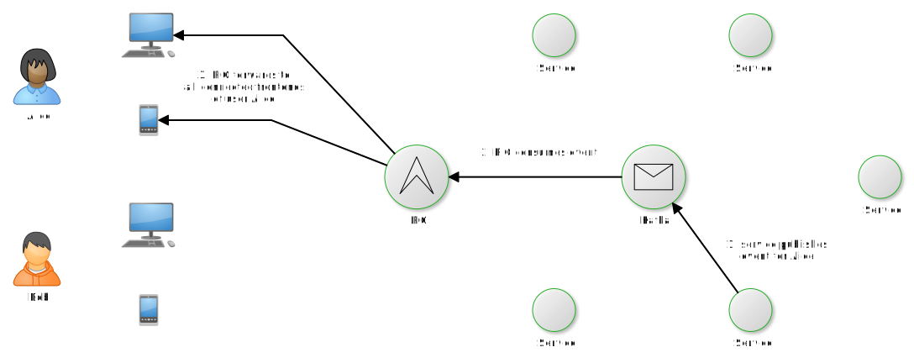

# RIG - Reactive Interaction Gateway

[](https://travis-ci.org/Accenture/reactive-interaction-gateway)

RIG is a scalable, open source gateway to your microservices. It solves the problem of
connection state (which users are online currently, with which devices), which allows your
microservices to be stateless. Pushing arbitrary messages to all connected frontends of a
specific user becomes as easy as publishing a message to a Kafka topic.

Additionally, RIG comes with a basic API gateway implementation. This way, RIG can be used to
communicate both ways between your microservices and your frontends.



Read more about why we built this [here](doc/motivation.md).

Other features:
- Massively scalable, thanks to
  - only using in-memory databases, along with eventually-consistent cluster synchronization
  - Erlang/OTP, the platform RIG is built on
- Towards frontends, support Server-Sent Events (SSE), WebSocket and HTTP long-polling
  connections
- Supports privileged users that are able to subscribe to messages of other users
- Supports JWT signature verification for APIs that need authentication
  - with blacklisting for immediate invalidation of tokens

### How is it different from other API gateways like [Tyk](https://tyk.io/) or [Kong](https://getkong.org/)?

They are great API gateways, but they don't handle asynchronous events.

### How is it different from Serverless' [Event Gateway](https://serverless.com/event-gateway/)?

While both are designed around the idea of being reactive to events, the Event Gateway has been
created with a different use case in mind, specializing on handling events across multiple cloud
providers. RIG's focus is on handling the online state of users, with multiple devices per user,
and the corresponding duplex connections. Consequently, RIG has a very strong focus on
horizontal scalability, while maintaining some of the characteristics of a traditional API
gateway. That said, if your architecture includes both, interactive UIs as frontends and
serverless backends, perhaps even running in different cloud environments, then you might even
benefit from running both gateways in a complementary way.

## Getting Started

Unless you use a Docker image, you'll need Elixir and the Mix build tool on your machine. You
can either follow the
[instructions on the Elixir website](https://elixir-lang.org/install.html), or use
[kiex](https://github.com/taylor/kiex) to install and manage Elixir runtimes (kiex is
recommended for development, as it allows you to jump to definitions inside the Elixir source
code, plus you can checkout upcoming Elixir versions easily).

### Start RIG in Development

To get up and running:

- Install dependencies with `mix deps.get`
- Start Phoenix endpoint with `mix phx.server`

Now you can visit [`localhost:4000`](http://localhost:4000) from your browser.

Additional notes:
- You can run tests with `mix test`. See [CONTRIBUTING.md](CONTRIBUTING.md) for more details.
- When debugging multi-node features, it's helpful to run the (named) nodes in `iex` sessions
  using `iex --sname nodename -S mix`.

## Configuration and Integration

It should be easy to integrate RIG into your current architecture. Check out
[the configuration guide](doc/configuration.md) for details.

## Deploy RIG to production

Currently we support two ways to deploy RIG: using Docker and using classical Erlang releases. Docker may be simpler for most use cases, but Erlang releases allow for hot code reloading.

### Deployment using Docker

```bash
# Build the image:
docker build -t rig .

# Run the container (with Kafka broker bound to the host's en0 IP):
export HOST_IP="$(ifconfig en0 inet | grep 'inet ' | awk '{ print $2 }')"
docker run --name rig1 -p 4000:4000 -e KAFKA_HOSTS="${HOST_IP}:9092" rig

# Check that the proxy api is indeed available on port 4000 (returns an empty list by default):
curl localhost:4000/apis
```

### Deployment using Erlang Releases
Using Erlang releases (instead of Docker containers) allows for hot code reloading. At the same
time, you have to take care of cross-compilation and
[the hiccups of code hot-loading](http://learnyousomeerlang.com/relups#the-hiccups-of-appups-and-relups).

TODO describe Distillery builds and perhaps hot code reloading.

## Contributing

Your help is welcome - please read [CONTRIBUTING.md](CONTRIBUTING.md) for details!

## Versioning

We use [SemVer](http://semver.org/) for versioning. For the versions available, see the
[tags on this repository](https://github.com/Accenture/reactive-interaction-gateway/tags).

## License

The Reactive Interaction Gateway (patent pending) is licensed under the Apache License 2.0 - see
[LICENSE](LICENSE) for details.

The work is sponsored by [Accenture](https://accenture.github.io/).

## Acknowledgments

RIG is built on the shoulders of giants. The most important ones, without dependencies:

- Elixir
- Erlang
- Phoenix Framework
- Brod
- Distillery
