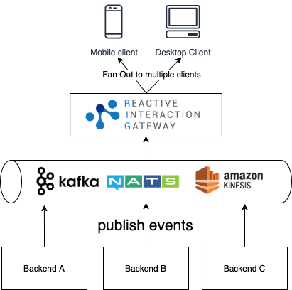

* [Picking up backend events and forwarding them to clients based on subscriptions](#picking-up-backend-events-and-forwarding-them-to-clients-based-on-subscriptions)
* [Forwarding client requests to backend services](#forwarding-client-requests-to-backend-services)
  * [Synchronously](#synchronously)
  * [Asynchronously - Fire&Forget](#asynchronously---fireforget)
  * [Asynchronously - Asnychronous Response](#asynchronously---asnychronous-response)
* [Built-in Features](#built-in-features)

RIG can be used in different scenarios.

## Picking up backend events and forwarding them to clients based on subscriptions

RIG acts as a fan-out publisher of backend events. Clients can simply subscribe to RIG in order to receive these events. This makes your frontend apps reactive and eliminates the need for polling.
Additionally clients can provide a filter during the subscription initialization and tell RIG in what type of events it is interested in. Thus, you don't have to implement this filter logic in all of your client applications, RIG takes care of it.
[The Glitch Mob example use case](http://localhost:3000/reactive-interaction-gateway/docs/intro.html#use-case-real-time-updates) describes one advantage of this reactive architectural approach.
Check out the [Intro](http://localhost:3000/reactive-interaction-gateway/docs/intro.html#reactive-interaction-gateway) for a detailed description and architecture diagram. Basically it works like this:

## Forwarding client requests to backend services

When client requests need to be forwarded to the backend, there are a couple of options how to do that technically.

### Synchronously

Lorem Ipsum

### Asynchronously - Fire&Forget

Lorem Ipsum

### Asynchronously - Asnychronous Response

Lorem Ipsum

## Built-in Features

Built on open standards, RIG is very easy to integrate – and easy to replace – which means low-cost, low-risk adoption. Unlike other solutions, RIG does not leak into your application – no libraries or SDKs required. Along with handling client requests and publishing events from backend to the frontend, RIG provides many built-in features such as:

- Easy to use and scalable by design:
  - Supports tens of thousands stable connections per node even on low-end machines.
  - Easy to add additional nodes.
  - Built on the battle-proven [Erlang/OTP](http://www.erlang.org/) distribution model.
  - Only uses in-memory data structures - no external dependencies to configure or scale.
- Connect using standard protocols:
  - Firewall friendly and future proof using Server-Sent Events (SSE)
    - [HTML5 standard](https://html.spec.whatwg.org/multipage/server-sent-events.html#server-sent-events).
    - Regular HTTP requests, so no issues with proxy servers or firewalls.
    - Connection multiplexing with HTTP/2 out of the box.
    - SSE implementation (browser) keeps track of connection drops and restores the connection automatically.
    - Polyfills available for older browsers.
  - WebSocket connections are supported, too.
  - HTTP long polling for situations where SSE and WS are not supported.
- Publish events from various sources:
  - Kafka
  - NATS
  - Amazon Kinesis
  - or publish via HTTP
- Convert a HTTP request to a message for asynchronous processing:
  - produce to Kafka topic, optionally wait for the result on another Kafka topic
  - produce to a NATS topic, optionally using NATS request-response to wait for the result
  - produce to Amazon Kinesis
- Uses the CNCF [CloudEvents specification](https://cloudevents.io/).
- Takes care of client connection state so you don't have to.
- Flexible event subscription model based on event types.
- Use existing services for authentication and authorization of users and subscriptions.
- JWT signature verification for APIs as a simple authentication check.
- Session blacklist with immediate session invalidation.
