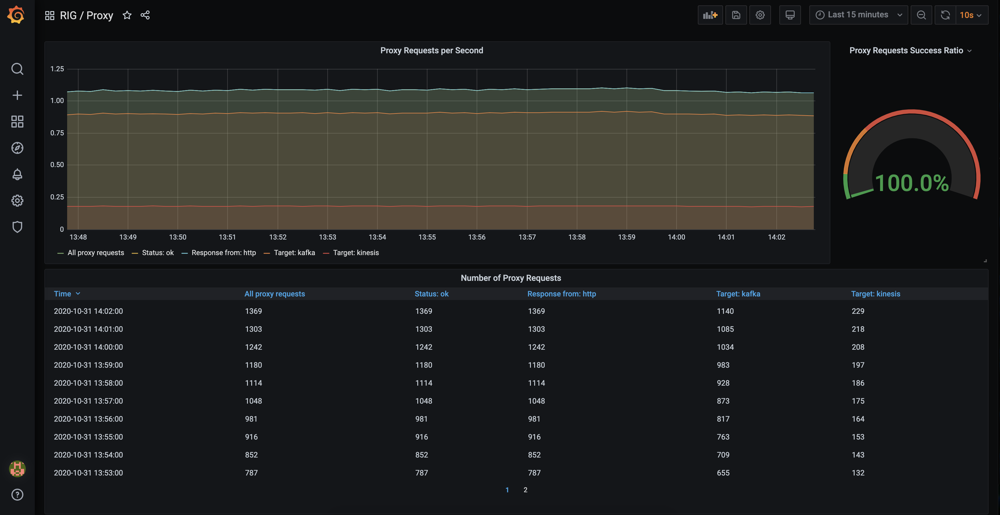
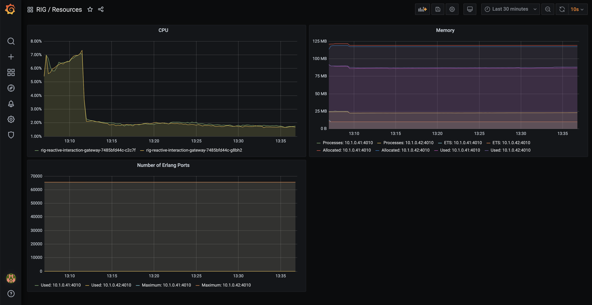
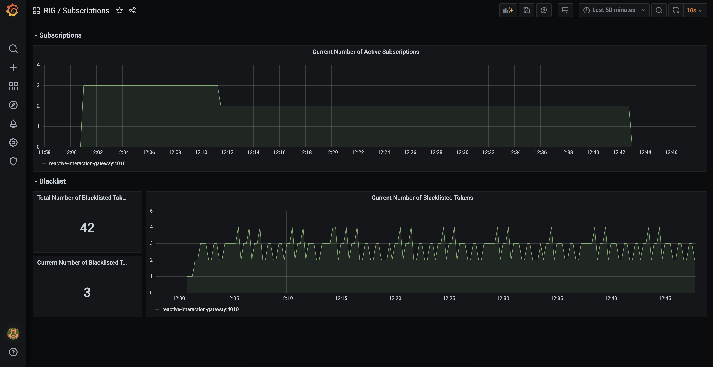

## Introduction

RIG is providing its metrics in [Prometheus](https://prometheus.io) format. Prometheus is CNCFs second graduated project and therefore can be assumed as de-facto standard.

These metrics can be used to be included into a monitoring platform like [Grafana](https://grafana.com/).

RIG exposes Metrics in [Prometheus](https://prometheus.io/) format on its API endpoint under [/metrics](http:localhost:4010/metrics).

## RIG Specific Metrics

### Proxy Metrics

#### `rig_proxy_requests_total`

With this metric the usage of RIGs API Proxy/Gateway can be monitored.

Following Labels are provided:

- **method** - The HTTP method called for this request Following possible values:
  - `GET`
  - `POST`
  - `PUT`
  - `PATCH`
  - `DELETE`
  - `HEAD`
  - `OPTIONS`
- **path_regex** - The path used for this request.
- **target** - The target for this request. Grabbed from proxy config. Following possible values:
  - `http`
  - `kafka`
  - `kinesis`
  - `N/A` - Not applicable, e.g., the request path is not configured.
- **response_from** - Where the response is provided from. Grabbed from proxy config. Following possible values:
  - `http`
  - `kafka`
  - `http_async`
  - `N/A` - Not applicable, e.g., the request path is not configured.
- **status** - The _internal_ status for the request. Attention: this status only tracks the internal rig process status. Once forwarded we track as "ok". We expect that called services are monitored on it's own. Following possible status codes:
  - `ok` - Forwarded successfully.
  - `bad_request` - Missing body parameters (`kafka` and `kinesis` only).
  - `not_found` - No configuration found for the given `method` and/or `path`.
  - `unreachable` - The backend cannot be connected to (e.g., service is offline or domain cannot be resolved)
  - `request_timeout` - The service is reachable but fails to deliver a response in time.
  - `response_timeout` - The endpoint has its `response_from` parameter set and RIG times out while waiting for a response.

### Events

#### `rig_consumed_events_forwarded_total`

Counts all events forwarded to a frontend.

Following Labels are provided:

- **type** - event type

#### `rig_consumed_events_total`

Counts all consumed events.

Following Labels are provided:

- **topic**
- **source**
  - `kafka`
  - `kinesis`

#### `rig_consumed_events_failed_total`

Counts all events that failed when handling an event.

- **topic**
- **source**
  - `kafka`
  - `kinesis`

#### `rig_consumed_event_processing_duration_milliseconds`

Histogram measuring how long it took to process the event (serialization, filtering & forwarding to a frontend).

- **topic**
- **source**
  - `kafka`
  - `kinesis`

#### `rig_produced_events_total`

Counts all successfully produced events.

- **topic**
- **target**
  - `kafka`
  - `kinesis`

#### `rig_produced_events_failed_total`

Counts all events that failed to be produced.

- **topic**
- **target**
  - `kafka`
  - `kinesis`

### Subscriptions

#### `rig_subscriptions_total`

Counts current number of event subscriptions.

### Blacklist

#### `rig_distributed_set_items_total{name="Elixir.SessionBlacklist"}`

Counts all JWTs that are blacklisted.

#### `rig_distributed_set_items_current{name="Elixir.SessionBlacklist"}`

Counts current number of blacklisted JWTs.

> `rig_distributed_set_items_*` is generic metric for all distributed sets, so you can create visualizations also for them.

## Standard Metrics

We are exposing the standard metrics providing information about the running application itself.

Following standard metrics are currently provided:

- erlang_vm_memory_ets_tables - *Erlang VM ETS Tables count*
- erlang_vm_memory_atom_bytes_total (Labels: Free, Used) - *The total amount of memory currently allocated for atoms. This memory is part of the memory presented as system memory.*
- erlang_vm_port_limit - *The maximum number of simultaneously existing ports at the local node*
- etc.

Detailed documentation to these standard metrics can be found [here](https://github.com/deadtrickster/prometheus.ex/tree/master/pages).

## Usecase

To use RIG-Metrics for monitoring in Grafana, following steps are required:

- Add the RIG-Metrics endpoint to the Prometheus config-file `prometheus.yml` + start the Prometheus server
  - In your RIG-Logs you should see continuous calls to the `/metrics`-Endpoint (Prometheus is implemented that it will actively gather data from the configured endpoints)
- In the Grafana frontend add Prometheus as a new datasource
- Now RIG-Metrics can be used to create dashboards

**Note**: This usecase was only described on a very high level to get an idea on how to use metrics. We highly recommend to check out the [**Prometheus**](https://prometheus.io/docs/prometheus/latest/getting_started/) and [**Grafana**](https://prometheus.io/docs/visualization/grafana/) Tutorials if you plan to set this up

## Grafana Dashboards

Example Grafana dashboards for the standard metrics can be found [**here**](https://github.com/deadtrickster/beam-dashboards).

### Custom Dashboards

We also provide our own Grafana dashboards with RIG specific metrics. You can find it in the [**dashboards folder**](https://github.com/Accenture/reactive-interaction-gateway/monitoring/metrics/dashboards).

> The [**metrics folder**](https://github.com/Accenture/reactive-interaction-gateway/monitoring/metrics) includes example setup using docker-compose.

#### Events

#### Proxy

#### Resources

#### Subscriptions

_Kudus to [deadtrickster](https://github.com/deadtrickster) for his awesome prometheus integration package_.
